# 🚀 Paulo Henrique
**Full Stack Developer • Performance • Automation**

<a href="https://www.linkedin.com/in/paulo-henrique-dev-fullstack/">LinkedIn</a>
&nbsp;•&nbsp;
<a href="mailto:ph3073610@gmail.com">Email</a>
&nbsp;•&nbsp;
<a href="https://github.com/Paulon34/ZAQUION-OS">ZAQUION OS</a>

🌎 <a href="./README.md">PT-BR</a> | **EN**

---

## 🔥 Building: ZAQUION OS
**A high-performance PWA/SPA ecosystem for financial workflows — automation, speed, and reliability.**

- ⚡ **Focus:** performance, fast UX, automated routines
- 🧩 **Stack:** JavaScript (ES6+), Firebase, PWA/SPA, Google Apps Script (GAS)
- 📌 **Status:** MVP in progress (roadmap evolving)

👉 **Repo:** https://github.com/Paulon34/ZAQUION-OS

---

## 🛠️ Tech Stack
- **Languages:** JavaScript (ES6+), Google Apps Script (GAS)
- **Backend/DB:** Firebase Realtime Database
- **Environment:** Linux (CachyOS / KDE Plasma), VS Code, Git/GitHub

---

## 📊 Métricas

  <table>
    <tr>
      <td align="center" width="50%">
        
      </td>
      <td align="center" width="50%">
        
      </td>
    </tr>
  </table>
<table>
  <tr>
    <td>
      
    </td>
  </tr>
</table>

---

## 🤝 Contact
- LinkedIn: https://www.linkedin.com/in/paulo-henrique-dev-fullstack/
- Email: ph3073610@gmail.com
